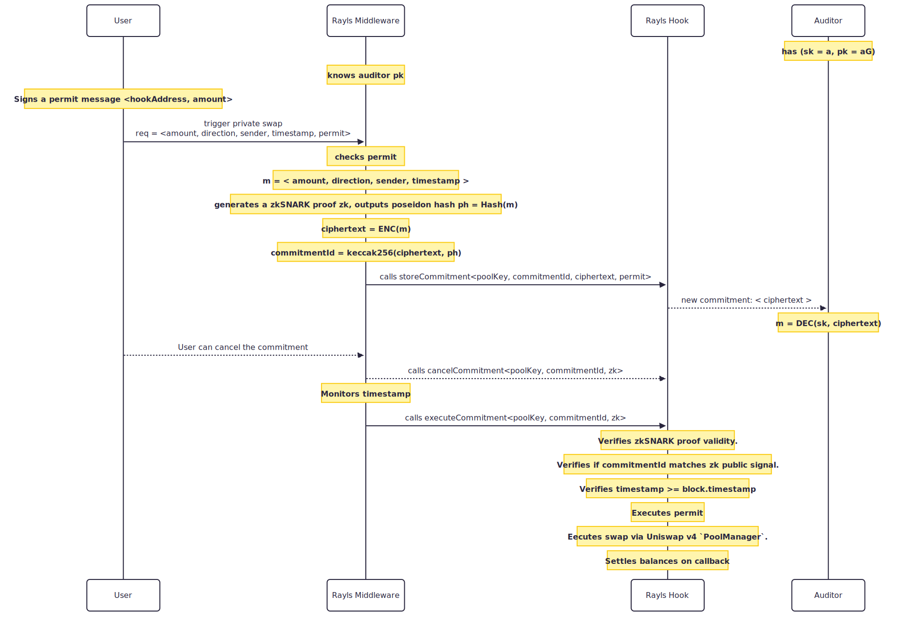

## 📄 `docs/privateSwaps.md`

🔐 Private Swap Commitments

This Uniswap v4 hook extension introduces private swaps that allow users to conceal their swap parameters until an execution timestamp is reached. Hidden swap values are committed on-chain via a unique commitment ID, then at execution time they are revealed and validated using zkSNARK proofs. Swap details are also encrypted using the Auditor’s public key and the generated ciphertext is stored on-chain, enabling independent verification at any time. The commitment Id is the result of running the cryptographic function keccak256 against the auditor ciphertext and the poseidon hash generated by the zk snark proof.

Key use cases include:

- MEV protection – hiding swap intent reduces frontrunning risk.

- Price impact mitigation for large swaps – users executing large trades can split them into multiple commitments to minimize token price impact in the pool.

- Compliance & oversight – DAOs and regulated protocols can prove onchain to an auditor the agreed swap schedules according to the defined tokenomics.

  

## 🔄 Flow

  

### 1. Create Commitment

- **User** through a UI:

  - Creates a swap commitment by defining amountIn, direction, timestamp.
  - Signs and sends along an ERC20 permit

- **Rayls Middleware**

  - Encrypts swap params using Auditor's pub key (file encrypt.js).
  - Creates and holds zkSNARK proofs of knowledge of swap params for commitment `id`..
  - Generates commitment id using Auditor's encryption + Poseidon hash from zk proof.
  - Calls `storeCommitment(id, ciphertext, permit)` with:
    - `id`: unique hash of the commitment.
    - `ciphertext`: encrypted swap details (amount, direction, timestamp).
    - `permit`: ERC20 permit signature.
    - Contract records commitment and emits `CommitmentStored`.

### 2. Execute Commitment

- **Rayls Middleware**

  - Monitors for commitments with expired timestamps.
  - Triggers commitment execution when timestamp is reached
  - When time is reached, calls `executeCommitment(id, zkProof)`.

- **Rayls Hook**

  - Verifies:
    - zkSNARK proof validity.
    - Commitment matches proof.
    - Permit authorizes token pull.
  - Contract executes swap via Uniswap v4 `PoolManager`.
  - Settles balances on callback
  - Emits `CommitmentExecuted`.

### 3. Cancel Commitment

- **User**
  - Triggers a commitment cancellation through a UI, before execution
- **Rayls Middleware**
  - Calls `cancelCommitment(id, zkProof)`.
- **Rayls Hook**
  - Marks commitment as canceled, clears heavy storage.
  - Emits `CommitmentCanceled`.

### 4. Auditor Flow

- **Auditor** can always:

  - Read `ciphertext` onchain.
  - Decrypt using it's own private key (file decrypt.js).
  - Verify swap parameters offchain for compliance.
  - Validates if permit matches the encrypted values

---

## Key notes

- We use circom for zkSNARK and ECIES encryption for the auditor (using nodejs scripts). Encryption in circom is too expensive.
- We could enforce the auditor to approve a commitement cancelation.
- When calling executeCommitment, Rayls Middleware would use private bundlers for additional MEV protection.

## Future Extensions and Use Cases

- Decentralized Executors: Anyone could register as an executor and earn a percentage of swap fees for executing commitments, creating an open marketplace of executors.
- Auditor-Gated Cancellation: Cancellation requests could require auditor approval, preventing users from revoking commitments that already passed compliance checks.
- Multi-Auditor Support: Commitments could be associated with multiple auditors, allowing collaborative oversight or redundancy in regulatory validation.
