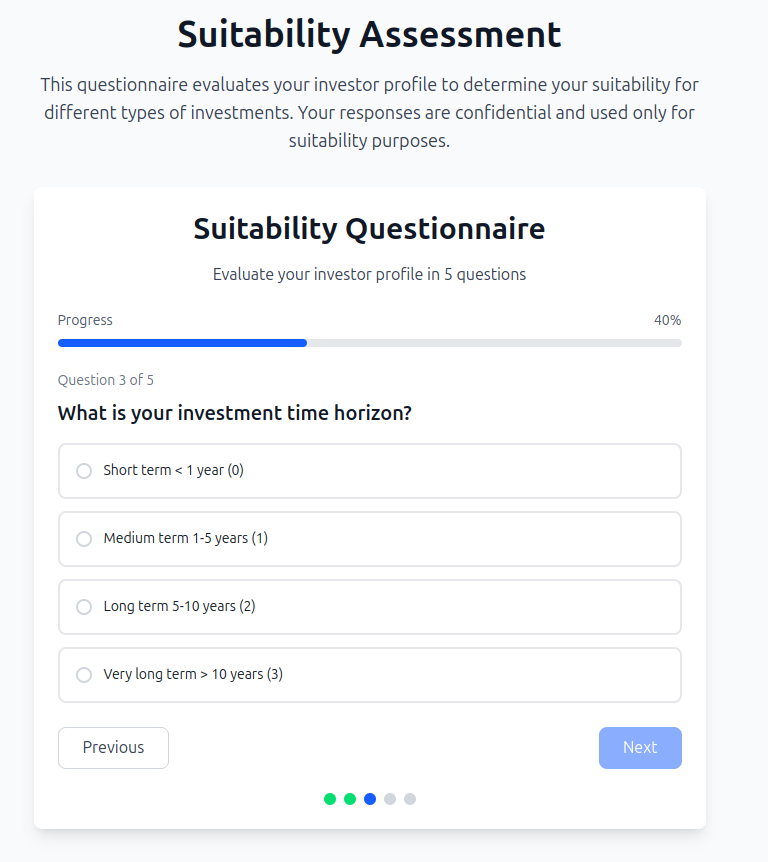
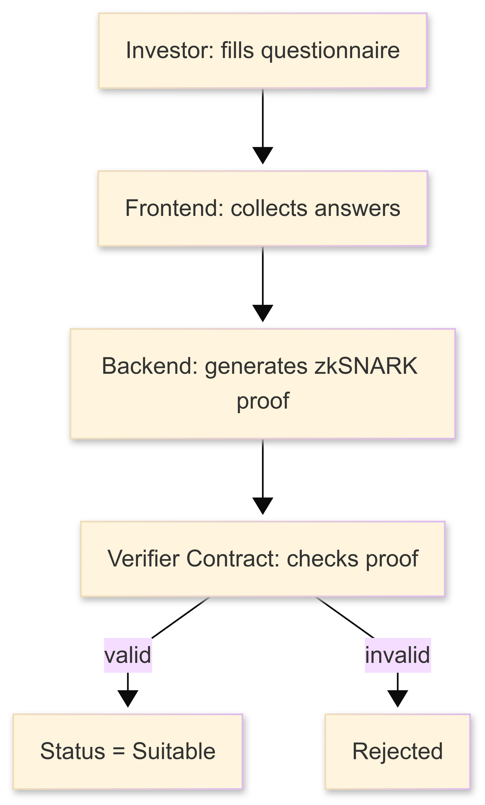

## 🛡️ Suitability Verifier Logic

The Suitability Verifier Logic ensures that **investors can prove compliance** with regulatory requirements without revealing their raw questionnaire responses. This is done using a **zkSNARK proof**.

   

## 🔄 Flow

  

1. **Investor (User)**

   - Fills out a suitability questionnaire offchain.
   - FE (frontend) generates a commitment hash of the answers.
   - BE (backend) computes zkSNARK proof:
     - Shows that the answers meet required conditions.
     - Keeps raw answers private.

2. **Frontend (FE)**

   - Collects user answers.
   - Passes them securely to BE.
   - Displays status to user (proof verified or not).

3. **Backend (BE)**

   - Generates proof using Circom circuit.
   - Sends proof + public signals to smart contract.

4. **Smart Contract (Verifier)**
   - Receives proof + signals.
   - Runs `verifyProof(...)` onchain.
   - Marks user as "suitable" if proof is valid.

---

## 🔐 Onchain Verification

The contract only verifies:

- Proof validity.
- Public signals match expected format (e.g., user address, KYC hash).

Raw answers **never leave the BE** and are not revealed onchain.

---

## 📋 Events

- `SuitabilityVerified(address indexed user)` – user passed the suitability check.
- `SuitabilityRevoked(address indexed user)` – regulator/admin revoked suitability.
